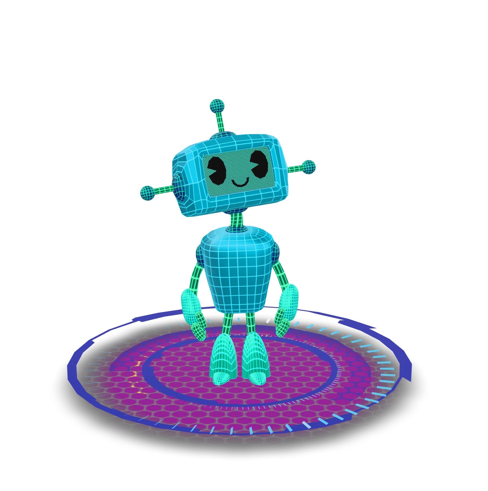

<div align="center">
  
  <h1>✨ Digital Odyssey ✨</h1>
  <p><em>Where code meets creativity</em></p>
  
  <p>
    <a href="#live-demo">🌐 Demo</a> •
    <a href="#features">🚀 Features</a> •
    <a href="#tech-stack">🛠️ Tech</a> •
    <a href="#getting-started">🏁 Start</a> •
    <a href="#project-structure">🗂️ Map</a>
  </p>

  [](https://www.nadzu.me)
</div>

<hr />

> "Simplicity is the ultimate sophistication."

## 🌟 Overview

A digital playground where tech meets art. Interactive 3D elements, AI-powered conversation, and immersive design create an experience beyond the typical portfolio.

## 🔥 Live Site

<div align="center">
  <h3><a href="https://www.nadzu.me">✨ EXPLORE NADZU.ME ✨</a></h3>
  
</div>

## ⚡ Features

<table align="center">
  <tr>
    <td align="center"><b>🌌 3D Magic</b></td>
    <td align="center"><b>🤖 AI Guide</b></td>
    <td align="center"><b>✨ Visual Flair</b></td>
  </tr>
  <tr>
    <td>Interactive Three.js models that bring projects to life</td>
    <td>Smart chatbot companion for seamless navigation</td>
    <td>Holographic textures and effects for visual impact</td>
  </tr>
</table>

<details>
  <summary><b>🔍 More Goodies</b></summary>
  
  - 📱 **Fully Responsive** — Perfect on every device
  - 🖥️ **Project Showcase** — Dynamic filtering system
  - 🚀 **Lightning Fast** — Optimized performance
  - 🎨 **Smooth Transitions** — Seamless navigation flow
</details>

## 🛠️ Tech Stack

<div align="center">
  
  
  
  
  
</div>

Built with:
- **⚛️ React + Vite** — Speed and flexibility
- **🎨 Tailwind** — Elegant, responsive design
- **🌐 Three.js** — Immersive 3D experiences
- **🧠 Custom AI** — Smart interaction layer

## 🚀 Quick Start

### Prerequisites
- Node.js (v14+)
- npm/yarn

### Setup
1. Clone it
   ```bash
   git clone https://github.com/nadun/portfolio.git
   cd portfolio
   ```

2. Install it
   ```bash
   npm install
   ```

3. Run it
   ```bash
   npm run dev
   ```

4. Visit `http://localhost:5173`

## 📂 Project Map

```
src/
├── assets/      # Visual treasures
├── components/  # UI building blocks
├── sections/    # Main content areas
├── data/        # Content configuration
├── utils/       # Helper functions
└── App.jsx      # Main component
```

## 🧑‍💻 Codebase Architecture & Interview Prep

### Functional Components & Hierarchy
- The app is built entirely with **React functional components** for modularity and reusability.
- **Main hierarchy:**
  - `App.jsx` (root, wraps everything in context)
    - `Navbar` (top navigation)
    - `Hero` (landing section, intro, 3D model, chatbot)
    - `Projects` (project cards, search/filter, popup details)
    - `Contact` (contact form with validation & captcha)
    - `Footer` (site footer)
    - **Shared components:** `BackToTop`, `LoadingSpinner`, `Model3DSection`, etc.

### Hooks Used & Use Cases
- **useState**: Local state for UI (e.g., form data, loading, toggles).
- **useEffect**: Side effects (e.g., data preloading, event listeners, animations).
- **useRef**: DOM refs (e.g., scroll targets, section refs, timers).
- **useReducer**: Complex state (e.g., chatbot message management).
- **useMemo/useCallback**: Memoization for performance (e.g., dynamic lists, handlers).
- **Custom hooks:**
  - `useAppLoading`: Manages global loading state and progress.
  - `useSectionObserver`: Tracks which section is active for dynamic backgrounds.
  - `useShaderBackground`: Handles animated background color transitions.
  - `useColorScheme` (context): Provides theme and color scheme switching.


## 🎨 Make It Yours

1. **Add Projects** — Update `ProjectData.json`
2. **Swap Models** — Replace assets in `src/assets/`
3. **Change Colors** — Modify `tailwind.config.js`
4. **Edit Sections** — Customize in `src/sections/`

## 📬 Connect

Nadun - [inbox.nadun@gmail.com](mailto:inbox.nadun@gmail+portfolioreadme.com)

Portfolio: [https://www.nadzu.me](https://www.nadzu.me)

---

<div align="center">
  <pre>
  +-----------------+
  |  CRAFTED WITH   |
  |     ❤️ Nuu      |
  +-----------------+
  </pre>
</div>
