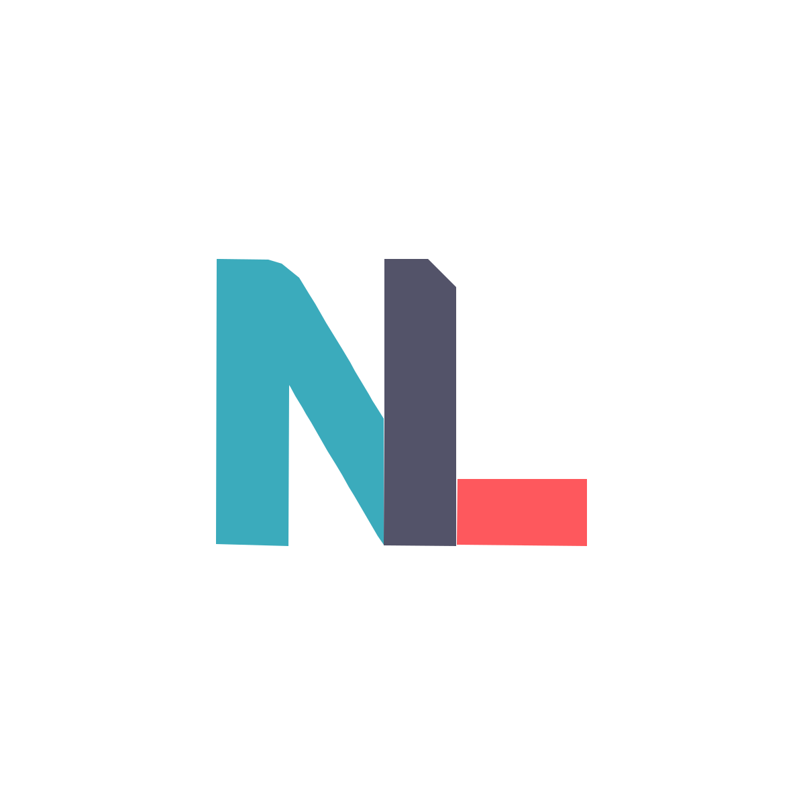

<div align="center">
  
  <h1><code>~/nadzu.me</code> </h1>
  <p><em>Super Fast Portfolio x Blogger</em></p>

  [](https://github.com/nxdun/Portfolio/tree/release/1.0.0)
</div>


## Tech-Stack

**Main Framework** - [Astro](https://astro.build/)  
**Type Checking** - [TypeScript](https://www.typescriptlang.org/)  
**Styling** - [TailwindCSS](https://tailwindcss.com/)  
**Static Search** - [Pagefind](https://pagefind.app/)  
**Icons** - [Icones](https://icones.js.org/)  
**Code Formatting** - [Prettier](https://prettier.io/)  
**Deployment** - [Cloudflare Pages](https://pages.cloudflare.com/)  
**Linting** - [ESLint](https://eslint.org)

## Running Locally

Install make if you don't have it already:

```bash
# for macOS
brew install make

# for Windows
choco install make
```

## Deployment

You need a free Cloudflare account and the following credentials:

- Environment variables (set these in your Cloudflare Pages project or CI):
  ```env
  CLOUDFLARE_API_TOKEN=...
  CLOUDFLARE_ACCOUNT_ID=...
  ```

- CLOUDFLARE_API_TOKEN
  - Where: Profile (top left corner in dashboard) > API Tokens > Create Token
  - Required permissions:
    - Account | Cloudflare Pages | Edit
    - User | User Details | Read

- CLOUDFLARE_ACCOUNT_ID
  - Where: Name (top right corner in dashboard) > Triple Dot Menu > Copy Account ID
