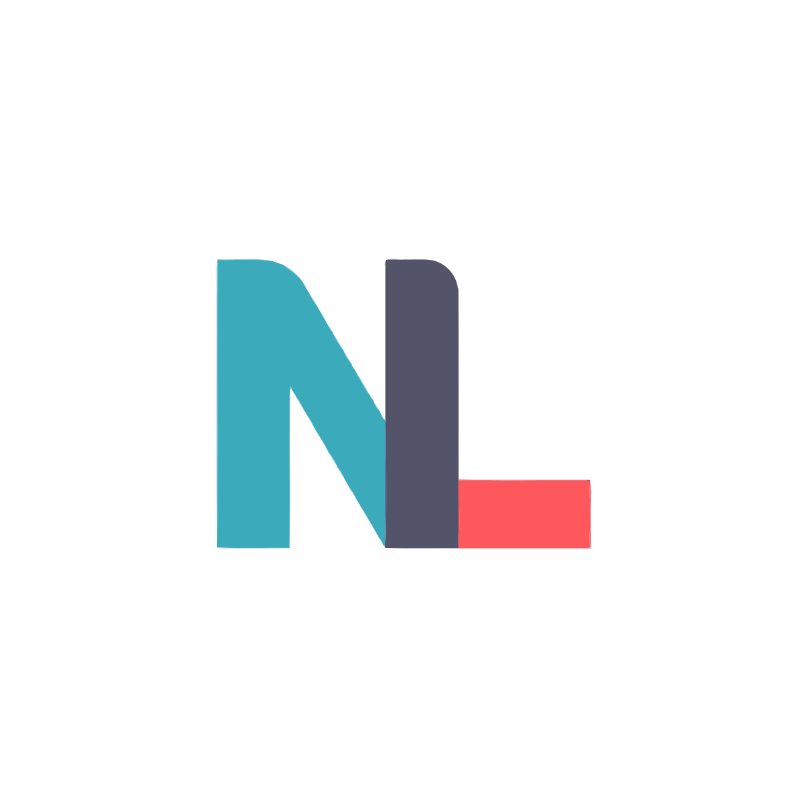

  
  <h1><a href="https://nadzu.me">|✨ Naduns PortFolioo ✨|</a></h1>
  
<em>Toolbox Crafted For Developers</em>

  
  

> "Simplicity is the ultimate sophistication."

🫧 Features

- Sleek, Sectioned single-page portfolio built with Vite + React.
- 3D ready BG with Three.js integration.
- Responsive design.

🥡 How to Set Up

1. Clone the repo and install dependencies: `npm install`.
2. Copy the example environment file: `cp .env.example .env`.
3. Start the dev server: `npm run dev` and open the shown localhost URL.
4. Build for production when ready: `npm run build` (output in `dist/`).
5. Deploy the `dist` folder to your static host of choice.

## 📬 Connect

Nadun - [inbox.nadun@gmail.com](mailto:inbox.nadun@gmail+portfolioreadme.com)

Portfolio: [https://www.nadzu.me](https://www.nadzu.me)

---

  <pre>
  +-----------------+
  |  CRAFTED BY     |
  |     ❤️ Nuu      |
  +-----------------+
  </pre>

